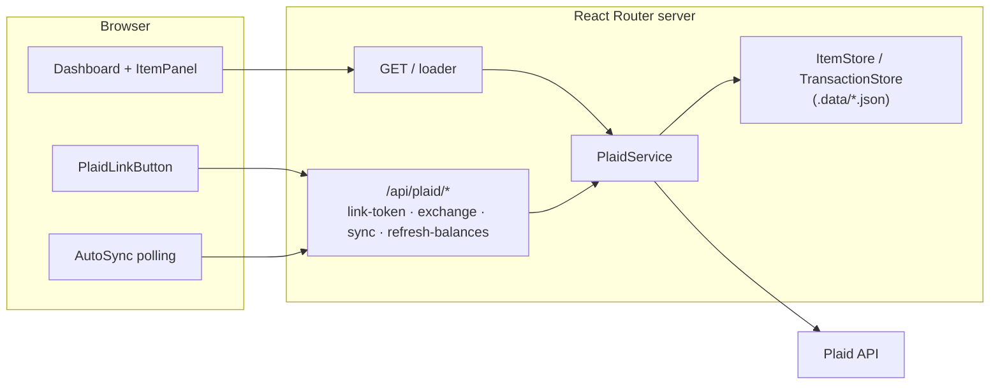

# Finanz

Single-user personal finance dashboard. Links bank accounts through [Plaid](https://plaid.com), shows account balances, and syncs transactions using Plaid's cursor-based sync protocol. Currently runs end-to-end against Plaid **Sandbox**.

## Stack

| Layer | Choice |
|---|---|
| Runtime / package manager | Bun |
| Framework | React 19 + React Router v8 (Framework Mode, SSR) |
| Build | Vite |
| Styling | Tailwind CSS v4 |
| Plaid | `plaid` (server SDK) + `react-plaid-link` (client) |
| Persistence | JSON files in `.data/` behind store interfaces (Postgres swap planned) |
| Language | TypeScript (strict) |

## Architecture



All client-server communication is React Router fetchers/forms posting to resource routes. No webhooks yet — `AutoSync` polls while initial transaction history backfills.

## Components

| Path | Responsibility |
|---|---|
| `app/routes/home.tsx` | Dashboard: loads items, account snapshots, and transactions; renders per-bank panels |
| `app/routes/api/plaid/*` | Resource routes: mint link tokens, exchange public tokens, run syncs, refresh balances |
| `app/lib/plaid/service.server.ts` | All Plaid logic: Link tokens (incl. update-mode reconnect), token exchange, cursor sync with pagination/retry, account fetches |
| `app/lib/plaid/item-store.server.ts` `app/lib/plaid/transaction-store.server.ts` | File-backed persistence. Implement the `ItemStore` / `TransactionStore` interfaces from `types.ts` — swap these to move to a real database |
| `app/lib/plaid/wiring.server.ts` | Composition root: wires stores into `PlaidService` (lazy singletons) |
| `app/lib/plaid/errors.server.ts` | Normalizes Plaid errors and maps them to item health states (reauth, consent expiring, error) |
| `app/lib/crypto.server.ts` | AES-256-GCM encryption for Plaid access tokens at rest |
| `app/lib/env.server.ts` | Validates all `PLAID_*` env vars at boot, fails fast |
| `app/components/plaid-link.tsx` | SSR-safe Plaid Link modal wrapper (link + reconnect flows) |
| `app/components/dashboard/item-panel.tsx` | Per-bank UI: health banners, accounts, transactions, sync/refresh actions |
| `app/components/dashboard/auto-sync.tsx` | Headless backoff polling while transaction history loads (webhook substitute) |

## Setup & Commands

```bash
cp .env.example .env   # fill in Plaid sandbox keys; generate encryption key: openssl rand -hex 32
bun install
```

| Command | What it does |
|---|---|
| `bun run dev` | Dev server with HMR at `localhost:5173` |
| `bun run build` | Production build to `build/` |
| `bun run start` | Serve production build at `:3000` |
| `bun run typecheck` | Generate route types + `tsc` |
| `bun test` | Unit tests (crypto, env validation, error mapping, sync reconciliation) |

## Fly.io deployment

The app runs as a single Fly Machine with a persistent volume for `.data/` (JSON file store). Do **not** scale beyond one machine — in-process file locks assume a single writer.

### Prerequisites

- [Fly CLI](https://fly.io/docs/hands-on/install-flyctl/) installed and authenticated (`fly auth login`)
- Plaid **production** API keys (requires [Plaid production access approval](https://plaid.com/docs/api/production/))
- Clerk **production** instance with live keys (`sk_live_…`, `pk_live_…`)

### 1. Create the Fly app (no deploy yet)

From the repo root:

```bash
fly launch --no-deploy
```

Review `fly.toml` — confirm `internal_port = 3000`, the `[mounts]` destination is `/app/.data`, and the app name/region look correct.

`fly launch` may create two Machines by default. Scale to exactly one:

```bash
fly scale count 1
```

### 2. Create the data volume

Create a volume in the **same region** as your Machine (check with `fly status`):

```bash
fly volumes create finanz_data --region <region> --size 1
```

The volume name must match `source` in `fly.toml` (`finanz_data`). Redeploy after the volume exists so the Machine mounts it at `/app/.data`.

### 3. Set secrets

Generate a fresh encryption key for production (`openssl rand -hex 32`). **Do not** reuse the sandbox key — existing encrypted tokens would be unreadable anyway on a fresh deploy.

```bash
fly secrets set \
  PLAID_CLIENT_ID="<production-client-id>" \
  PLAID_SECRET="<production-secret>" \
  PLAID_ENV="production" \
  PLAID_PRODUCTS="transactions" \
  PLAID_COUNTRY_CODES="US" \
  PLAID_TRANSACTIONS_DAYS_REQUESTED="90" \
  PLAID_TOKEN_ENCRYPTION_KEY="<64-hex-chars-from-openssl-rand-hex-32>" \
  CLERK_SECRET_KEY="sk_live_..." \
  VITE_CLERK_PUBLISHABLE_KEY="pk_live_..."
```

Optional Plaid settings (set when needed):

```bash
fly secrets set PLAID_REDIRECT_URI="https://<your-domain>/..."   # mobile OAuth
fly secrets set PLAID_WEBHOOK_URL="https://<your-domain>/api/plaid/webhook"
```

### 4. Clerk production instance

1. In the [Clerk Dashboard](https://dashboard.clerk.com/), create a **production** instance (separate from development).
2. Add your Fly/custom domain under **Domains** and create the DNS **CNAME** records Clerk provides; wait until verification succeeds.
3. Under **API keys**, copy the live `sk_live_…` and `pk_live_…` keys into `fly secrets set` (step 3).
4. Mirror the development auth configuration:
   - **Email** one-time passcode sign-in enabled
   - **Passwords** disabled
   - **Sign-up restrictions** / allowlist so only your account can sign in (single-user app)

### 5. Deploy

```bash
fly deploy
```

Health checks hit `GET /sign-in` (returns 200; unauthenticated `/` redirects and is unsuitable). Confirm with `fly status` and `fly logs`.

### Local Docker smoke test

```bash
docker build -t finanz .
docker run --rm -p 3000:3000 \
  -e PLAID_CLIENT_ID=... -e PLAID_SECRET=... -e PLAID_ENV=sandbox \
  -e PLAID_PRODUCTS=transactions -e PLAID_COUNTRY_CODES=US \
  -e PLAID_TRANSACTIONS_DAYS_REQUESTED=90 \
  -e PLAID_TOKEN_ENCRYPTION_KEY="$(openssl rand -hex 32)" \
  -e CLERK_SECRET_KEY=sk_test_... -e VITE_CLERK_PUBLISHABLE_KEY=pk_test_... \
  finanz
```

Visit `http://localhost:3000/sign-in` to confirm the server boots and env validation passes.

## Design decisions

- **No auth, single user by design** — a hardcoded user id is sent to Plaid.
- **Access tokens encrypted at rest** (AES-256-GCM); link/public tokens are never stored.
- **Free vs. billed calls**: page load uses free `/accounts/get`; billed real-time `/accounts/balance/get` only behind the explicit "Refresh balances" button.
- **Duplicate institutions blocked** on exchange — Plaid Item slots are permanently consumed on the Trial plan.
- **Reconnects use Link update mode** to repair an existing Item instead of creating a new billable one.
- **Persistence seam**: all storage goes through `ItemStore` / `TransactionStore` interfaces so the JSON files can be replaced with Postgres without touching Plaid logic.
