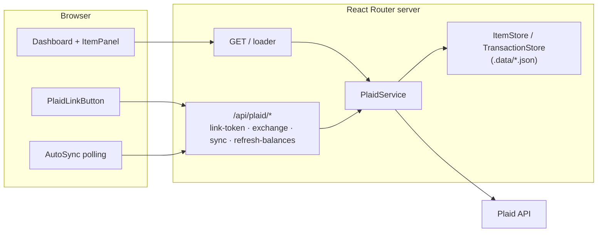

# Finanz

Single-user personal finance dashboard. Links bank accounts through [Plaid](https://plaid.com), shows account balances, and syncs transactions using Plaid's cursor-based sync protocol. Currently runs end-to-end against Plaid **Sandbox**.

## Stack

| Layer | Choice |
|---|---|
| Runtime / package manager | Bun |
| Framework | React 19 + React Router v8 (Framework Mode, SSR) |
| Build | Vite |
| Styling | Tailwind CSS v4 |
| Plaid | `plaid` (server SDK) + `react-plaid-link` (client) |
| Persistence | JSON files in `.data/` behind store interfaces (Postgres swap planned) |
| Language | TypeScript (strict) |

## Architecture



All client-server communication is React Router fetchers/forms posting to resource routes. No webhooks yet — `AutoSync` polls while initial transaction history backfills.

## Components

| Path | Responsibility |
|---|---|
| `app/routes/home.tsx` | Dashboard: loads items, account snapshots, and transactions; renders per-bank panels |
| `app/routes/api/plaid/*` | Resource routes: mint link tokens, exchange public tokens, run syncs, refresh balances |
| `app/lib/plaid/service.server.ts` | All Plaid logic: Link tokens (incl. update-mode reconnect), token exchange, cursor sync with pagination/retry, account fetches |
| `app/lib/plaid/item-store.server.ts` `app/lib/plaid/transaction-store.server.ts` | File-backed persistence. Implement the `ItemStore` / `TransactionStore` interfaces from `types.ts` — swap these to move to a real database |
| `app/lib/plaid/wiring.server.ts` | Composition root: wires stores into `PlaidService` (lazy singletons) |
| `app/lib/plaid/errors.server.ts` | Normalizes Plaid errors and maps them to item health states (reauth, consent expiring, error) |
| `app/lib/crypto.server.ts` | AES-256-GCM encryption for Plaid access tokens at rest |
| `app/lib/env.server.ts` | Validates all `PLAID_*` env vars at boot, fails fast |
| `app/components/plaid-link.tsx` | SSR-safe Plaid Link modal wrapper (link + reconnect flows) |
| `app/components/dashboard/item-panel.tsx` | Per-bank UI: health banners, accounts, transactions, sync/refresh actions |
| `app/components/dashboard/auto-sync.tsx` | Headless backoff polling while transaction history loads (webhook substitute) |

## Setup & Commands

```bash
cp .env.example .env   # fill in Plaid sandbox keys; generate encryption key: openssl rand -hex 32
bun install
```

| Command | What it does |
|---|---|
| `bun run dev` | Dev server with HMR at `localhost:5173` |
| `bun run build` | Production build to `build/` |
| `bun run start` | Serve production build at `:3000` |
| `bun run typecheck` | Generate route types + `tsc` |
| `bun test` | Unit tests (crypto, env validation, error mapping, sync reconciliation) |

## Design decisions

- **No auth, single user by design** — a hardcoded user id is sent to Plaid.
- **Access tokens encrypted at rest** (AES-256-GCM); link/public tokens are never stored.
- **Free vs. billed calls**: page load uses free `/accounts/get`; billed real-time `/accounts/balance/get` only behind the explicit "Refresh balances" button.
- **Duplicate institutions blocked** on exchange — Plaid Item slots are permanently consumed on the Trial plan.
- **Reconnects use Link update mode** to repair an existing Item instead of creating a new billable one.
- **Persistence seam**: all storage goes through `ItemStore` / `TransactionStore` interfaces so the JSON files can be replaced with Postgres without touching Plaid logic.
