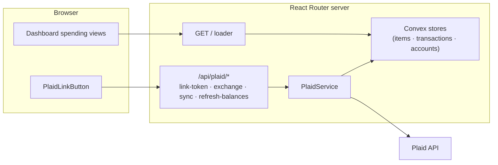

# Finanz

Clerk-authenticated personal finance dashboard with per-user data isolation. Links Items through [Plaid](https://plaid.com) and derives month-over-month spending views from Transactions synchronized with Plaid's cursor-based protocol. Supports Plaid Sandbox and production through `PLAID_ENV`; `.env.example` defaults to Sandbox. A Clerk allowlist can restrict a deployment to one user.

## Stack

| Layer | Choice |
|---|---|
| Runtime / package manager | Bun |
| Framework | React 19 + React Router v8 (Framework Mode, SSR) |
| Build | Vite |
| Styling | Tailwind CSS v4 |
| Plaid | `plaid` (server SDK) + `react-plaid-link` (client) |
| Authentication | Clerk |
| Persistence | Convex (users, Items, Transactions, and Linked Account snapshots, all user-scoped) |
| Language | TypeScript (strict) |

## Architecture



Page data is served through React Router loaders. Plaid mutations use React Router fetchers/forms and resource routes, while Clerk's client SDK handles sign-in and sign-up. No webhook route is implemented. `ItemPanel` and its `AutoSync` backfill polling are implemented but are not currently mounted by the home route.

## Components

| Path | Responsibility |
|---|---|
| `app/routes/home.tsx` | Authenticated dashboard: loads user-scoped Items, Linked Account snapshots, and Transactions; renders aggregate spending views |
| `app/routes/api/plaid/*` | Resource routes: mint link tokens, exchange public tokens, run syncs, refresh balances |
| `app/lib/auth.server.ts` | Requires Clerk authentication and upserts authenticated users into Convex |
| `app/lib/plaid/service.server.ts` | Orchestrates Link tokens, token exchange, synchronization, and Linked Account retrieval |
| `app/lib/plaid/sync-engine.server.ts` | Implements cursor pagination, Sync Diff accumulation, and mutation retry |
| `app/lib/plaid/convex-*-store.server.ts` | Convex-backed persistence implementing the `ItemStore` / `TransactionStore` / `AccountStore` interfaces from `types.ts` |
| `app/lib/plaid/wiring.server.ts` | Composition root: wires stores into `PlaidService` (lazy singletons) |
| `app/lib/plaid/errors.server.ts` | Normalizes Plaid errors and maps them to item health states (reauth, consent expiring, error) |
| `app/lib/crypto.server.ts` | AES-256-GCM encryption for Plaid access tokens at rest |
| `app/lib/env.server.ts` | Validates all `PLAID_*` env vars at boot, fails fast |
| `app/components/plaid-link.tsx` | SSR-safe Plaid Link modal wrapper; linking is mounted and reconnect support is implemented |
| `app/components/dashboard/item-panel.tsx` | Implemented but currently unmounted per-Item UI: health banners, Linked Accounts, Transactions, and sync/refresh actions |
| `app/components/dashboard/auto-sync.tsx` | Implemented but currently inactive backoff polling while transaction history loads |

## Setup & Commands

```bash
cp .env.example .env   # fill in Plaid/Clerk keys; generate encryption key: openssl rand -hex 32
bun install
bun run convex:dev     # create/select a dev deployment and push the schema/functions
```

Set `CONVEX_URL` in `.env` to the deployment's `CONVEX_CLOUD_URL` (the `CONVEX_SITE_URL` is not used). Generate `CONVEX_INTERNAL_SECRET` with `openssl rand -hex 32`, add it to `.env`, and set the same value on the development deployment:

```bash
bunx convex env set CONVEX_INTERNAL_SECRET
```

| Command | What it does |
|---|---|
| `bun run dev` | Dev server with HMR at `localhost:5173` |
| `bun run convex:dev` | Push Convex schema/functions to the development deployment and watch for changes |
| `bun run build` | Production build to `build/` |
| `bun run start` | Serve production build at `:3000` |
| `bun run typecheck` | Generate route types + `tsc` |
| `bun test` | Tests for crypto, environment validation, Plaid errors and sync behavior, dashboard calculations, authenticated API identity, and user-scoped Convex persistence |

## Fly.io deployment

The app runs as a single Fly Machine. Per-Item synchronization uses an in-process lock, so the current implementation should run on one application Machine unless that lock is replaced with a distributed lock. A Clerk allowlist can separately restrict the deployment to one user.

**Deploy order:** run `bunx convex deploy` (pushes schema/functions to the production Convex deployment, authenticated via `CONVEX_DEPLOY_KEY`) **before** `fly deploy` whenever Convex functions or schema change. The Fly image does not include Convex code — the app talks to the hosted deployment at `CONVEX_URL`.

All Fly configuration is **runtime secrets** (`fly secrets set`). There are no build-time environment variables: the Clerk publishable key is served at runtime by `rootAuthLoader` (despite the `VITE_` prefix, it is read from `process.env` on the server), and Convex is server-only, so nothing sensitive is baked into the client bundle during `docker build`. The Dockerfile needs no build args.

### Environment variables

| Variable | Where to set | Runtime |
|---|---|---|
| `PLAID_CLIENT_ID` | local `.env` · Fly secrets | yes |
| `PLAID_SECRET` | local `.env` · Fly secrets | yes |
| `PLAID_ENV` | local `.env` · Fly secrets (`production`) | yes |
| `PLAID_PRODUCTS` | local `.env` · Fly secrets | yes |
| `PLAID_COUNTRY_CODES` | local `.env` · Fly secrets | yes |
| `PLAID_TRANSACTIONS_DAYS_REQUESTED` | local `.env` · Fly secrets | yes |
| `PLAID_TOKEN_ENCRYPTION_KEY` | local `.env` · Fly secrets | yes |
| `PLAID_REDIRECT_URI` | local `.env` · Fly secrets (optional) | yes |
| `PLAID_WEBHOOK_URL` | local `.env` · Fly secrets (optional) | yes |
| `PLAID_SANDBOX_LINK_PHONE` | local `.env` only (optional) | yes |
| `CLERK_SECRET_KEY` | local `.env` · Fly secrets (`sk_live_…`) | yes |
| `VITE_CLERK_PUBLISHABLE_KEY` | local `.env` · Fly secrets (`pk_live_…`) | yes |
| `CONVEX_URL` | local `.env` · Fly secrets (prod `CONVEX_CLOUD_URL`) | yes |
| `CONVEX_INTERNAL_SECRET` | local `.env` · Fly secrets · Convex deployment env (same value) | yes |
| `CONVEX_DEPLOYMENT` | local `.env` only (set by `convex dev`) | no |
| `CONVEX_DEPLOY_KEY` | local machine / CI only (Convex deploy keys) | no |

Validated at boot by `app/lib/env.server.ts` (see `.env.example` for defaults and comments).

### Prerequisites

- [Fly CLI](https://fly.io/docs/hands-on/install-flyctl/) installed and authenticated (`fly auth login`)
- Plaid **production** API keys (requires [Plaid production access approval](https://plaid.com/docs/api/production/))
- Clerk **production** instance with live keys (`sk_live_…`, `pk_live_…`)
- A [Convex](https://dashboard.convex.dev/) project associated with this repository (`bun run convex:dev`)
- `CONVEX_DEPLOY_KEY` on your machine or CI for `bunx convex deploy` (Convex dashboard → Settings → Deploy keys)

### 1. Configure the Fly app (no deploy yet)

The repository includes `fly.toml`. Before the first deployment, choose an available Fly app name and desired region by updating its `app` and `primary_region`, then create or register that app with Fly. Keep `internal_port = 3000`.

From the repo root, if the configured app does not exist yet:

```bash
fly launch --no-deploy
```

Review any changes made by `fly launch` and retain the repository's port and Machine settings.

`fly launch` may create two Machines by default. Scale to exactly one:

```bash
fly scale count 1
```

If upgrading from a deployment that used the old `finanz_data` volume, destroy it after confirming the app runs without it:

```bash
fly volumes list
fly volumes destroy <volume-id>
```

### 2. Configure and deploy Convex

Generate a shared secret, set it on the production Convex deployment, and deploy the functions and schema:

```bash
openssl rand -hex 32
bunx convex env set --prod CONVEX_INTERNAL_SECRET
bunx convex deploy
```

Enter the generated value when prompted by `convex env set` and retain it for the Fly secret in step 3. In the Convex dashboard, copy the production deployment's `CONVEX_CLOUD_URL`; use that value as `CONVEX_URL`. `CONVEX_SITE_URL` is not used by this app.

### 3. Set Fly secrets

Generate a fresh encryption key for production (`openssl rand -hex 32`). **Do not** reuse the sandbox key — existing encrypted tokens would be unreadable anyway on a fresh deploy.

```bash
fly secrets set \
  PLAID_CLIENT_ID="<production-client-id>" \
  PLAID_SECRET="<production-secret>" \
  PLAID_ENV="production" \
  PLAID_PRODUCTS="transactions" \
  PLAID_COUNTRY_CODES="US" \
  PLAID_TRANSACTIONS_DAYS_REQUESTED="90" \
  PLAID_TOKEN_ENCRYPTION_KEY="<64-hex-chars-from-openssl-rand-hex-32>" \
  CLERK_SECRET_KEY="sk_live_..." \
  VITE_CLERK_PUBLISHABLE_KEY="pk_live_..." \
  CONVEX_URL="https://<production-deployment>.convex.cloud" \
  CONVEX_INTERNAL_SECRET="<same-shared-secret-set-on-convex>"
```

Optional Plaid redirect setting (set when needed):

```bash
fly secrets set PLAID_REDIRECT_URI="https://<your-domain>/..."   # mobile OAuth
```

Do not set `PLAID_WEBHOOK_URL` until a webhook resource route is implemented and deployed.

### 4. Clerk production instance

1. In the [Clerk Dashboard](https://dashboard.clerk.com/), create a **production** instance (separate from development).
2. Add your Fly/custom domain under **Domains** and create the DNS **CNAME** records Clerk provides; wait until verification succeeds.
3. Under **API keys**, copy the live `sk_live_…` and `pk_live_…` keys into `fly secrets set` (step 3).
4. Mirror the development auth configuration:
   - **Email** one-time passcode sign-in enabled
   - **Passwords** disabled
   - **Sign-up restrictions** / allowlist so only your account can sign in (single-user app)

### 5. Deploy

If Convex schema or functions changed since the last production push, run `bunx convex deploy` first (step 2), then:

```bash
fly deploy
```

### 6. Verify

Fly health checks hit `GET /sign-in` (returns 200; unauthenticated `/` redirects and is unsuitable for the check). After deploy:

1. `fly status` — Machine is `started` and the `/sign-in` health check is passing.
2. `fly logs` — No `Missing required environment variable` errors from env validation.
3. Open `https://<your-domain>/sign-in` — Clerk sign-in loads (confirms live keys and domain CNAMEs).
4. Sign in and link a bank via Plaid Link — confirms Plaid production keys and `CONVEX_URL` reach Convex.
5. In the [Convex dashboard](https://dashboard.convex.dev/), confirm an `items` row appears after linking. `accounts` and `transactions` rows appear after their respective Plaid calls succeed; transaction backfill may not be ready immediately.

### Local Docker smoke test

```bash
docker build -t finanz .
docker run --rm -p 3000:3000 \
  -e PLAID_CLIENT_ID=... -e PLAID_SECRET=... -e PLAID_ENV=sandbox \
  -e PLAID_PRODUCTS=transactions -e PLAID_COUNTRY_CODES=US \
  -e PLAID_TRANSACTIONS_DAYS_REQUESTED=90 \
  -e PLAID_TOKEN_ENCRYPTION_KEY="$(openssl rand -hex 32)" \
  -e CLERK_SECRET_KEY=sk_test_... -e VITE_CLERK_PUBLISHABLE_KEY=pk_test_... \
  -e CONVEX_URL=https://<development-deployment>.convex.cloud \
  -e CONVEX_INTERNAL_SECRET=<same-secret-set-on-development-convex> \
  finanz
```

Use an existing development Convex deployment with its schema/functions pushed. Visit `http://localhost:3000/sign-in` to confirm the server boots and env validation passes.

## Design decisions

- **Clerk authentication with user-scoped persistence** — each request uses the authenticated Clerk user ID, which is also sent to Plaid as `client_user_id`. A Clerk allowlist can restrict a deployment to one user.
- **Access tokens encrypted at rest** (AES-256-GCM); link/public tokens are never stored.
- **Linked Account snapshots**: page load reads stored snapshots from Convex. `/accounts/get` refreshes them during Item exchange and after transaction sync; `/accounts/balance/get` is exposed through the refresh-balances action, whose current button is in the unmounted `ItemPanel`.
- **Best-effort duplicate-institution check** — exchange is rejected when supplied Plaid metadata identifies an institution already linked by that user. Database uniqueness does not enforce this constraint.
- **Reconnects use Link update mode** to repair an existing Item instead of creating a new billable one.
- **Persistence seam**: Plaid Item, Transaction, and Linked Account persistence goes through `ItemStore` / `TransactionStore` / `AccountStore` interfaces backed by Convex. Clerk-user persistence is handled separately.
